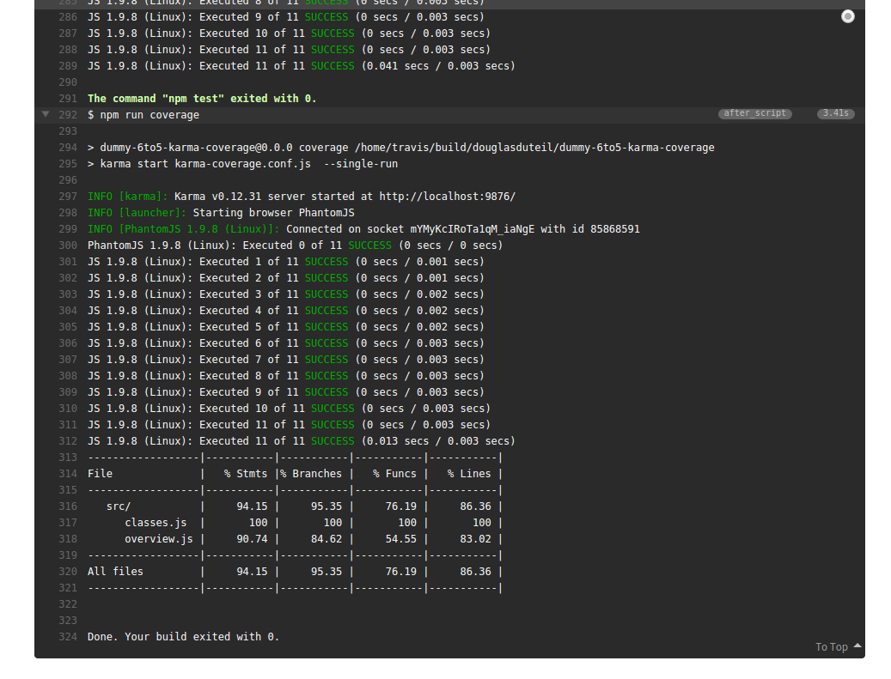

# isparta [![Build Status][travis-image]][travis-url] [![NPM version][npm-image]][npm-url]

> Isparta is a code coverage tool for ES6 using the [6to5](https://github.com/6to5/6to5).

Its intention is to be used with [karma](http://karma-runner.github.io/) and [karma-coverage](https://github.com/karma-runner/karma-coverage), which provides code coverage reports using [istanbul](https://github.com/gotwarlost/istanbul).

## Installation

For the moment, a custom fork of karma-coverage needs to be installed which supports isparta is an instrumenter.

```sh
$ npm install --save-dev douglasduteil/karma-coverage#next
```

Isparta can be installed using

```sh
$ npm install --save-dev douglasduteil/isparta
```

## Usage

```bash
isparta cover src/foo.es6.js
istanbul report text-summary
```

**Not all the istanbul command/options are available with isparta**
**Consult `isparta -h` for more information**

### With Karma

To use isparta, set the [instrumenter](https://github.com/karma-runner/karma-coverage/blob/master/README.md#instrumenter) for the JavaScript file type to `isparta`.

```js
coverageReporter: {
  // configure the reporter to use isparta for JavaScript coverage
  // Only on { "karma-coverage": "douglasduteil/karma-coverage#next" }
  instrumenters: { isparta : require('isparta') },
  instrumenter: {
    '**/*.js': 'isparta'
  }
}
```

But can customize the 6to5 options thanks to my [fork](https://github.com/douglasduteil/karma-coverage/tree/next)

```js

var to5Options = { experimental: true };

// [...]

coverageReporter: {
  // configure the reporter to use isparta for JavaScript coverage
  // Only on { "karma-coverage": "douglasduteil/karma-coverage#next" }
  instrumenters: { isparta : require('isparta') },
  instrumenter: {
    '**/*.js': 'isparta'
  },
  instrumenterOptions: {
    isparta: { to5 : to5Options }
  }
}
```



## License

    Copyright © 2014 Douglas Duteil <douglasduteil@gmail.com>
    This work is free. You can redistribute it and/or modify it under the
    terms of the Do What The Fuck You Want To Public License, Version 2,
    as published by Sam Hocevar. See the LICENCE file for more details.

[npm-url]: https://npmjs.org/package/isparta
[npm-image]: http://img.shields.io/npm/v/isparta.svg
[travis-url]: http://travis-ci.org/douglasduteil/isparta
[travis-image]: http://travis-ci.org/douglasduteil/isparta.svg?branch=master
